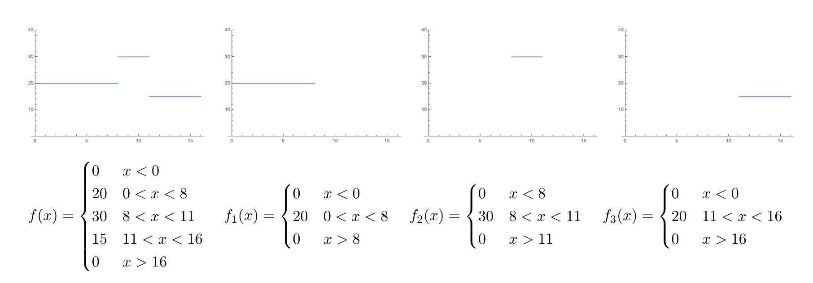
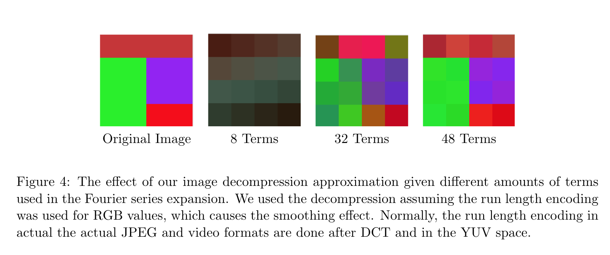
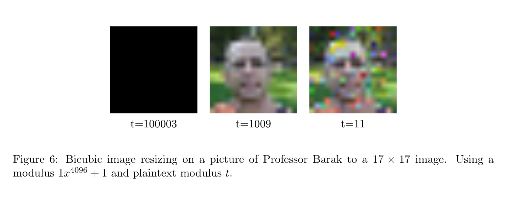
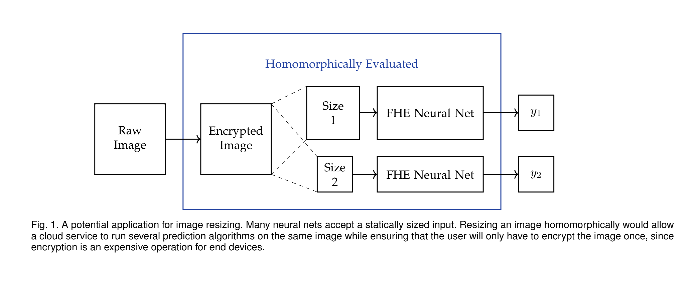

# Fully Homomorphic Image Processing using SEAL
These days neural networks and fully homomorphic encryption are a meme. For example, Microsoft demonstrated with Cryptonets of a neural network generating predictions fully homomorphically on the MNIST dataset. However, it would be useful to have a way to preprocess images homomorphically. Consider the use case where an edge device sends a homomorphically encrypted image to a server that runs a prediction algorithm with two neural networks that take in different sized features, as is common. It would be prohibitive to make the edge device homomorphically encrypt two copies of the images, since that would be prohibitively expensive. Therefore, having proprocessing and feature extraction computed homomorphically will provide much more flexibility for homomorphic neural nets.  

## Homomorphic Image Decompression

We will show how to homomorphically compute something simpler than JPEG decompression, run length decoding. The idea is the same: we would like to expand out a [run length encoding](https://en.wikipedia.org/wiki/Run-length_encoding) (which is used after DCT step of the JPEG standard)
This is difficult to do because converting the run length decoding into a boolean circuit is completely unfeasable due to the number of gates needed. Without resorting to evaluating a boolean circuit, the following operations are not possible with homomorphic encryption

* Dividing by a ciphertext
* Conditionals (if, else)
* No looping on variables
* Cannot prematurely exit program

Since the boolean circuit approach is not feasable by __many multiple orders of magnitude__, we use an approximation approach. For each run length tuple, we approximate a "step" function defined by 1 if between b1 and b2 and 0 otherwise using a discrete Fourier series. We also taylor expand the cosine and sine function. Note that it is difficult to use a sigmoid type function for approximating, because we cannot use division. 

Since the H.264 and MPEG video encoding standard uses run length encodings 
that encode lengths of 16 (4 by 4 blocks) and JPEG uses run length 
encodings to encode lengths of 64 (8 by 8 blocks), we implemented 
our homomorphic run length decoding for output lengths of 16 and 64.
herefore, we use the following method of approximating the run length encoding. 
Consider an example with a fixed output length of 16 as in the case for video encodings. 
```
[(20, 8), (30, 3), (15, 5)]
gets decoded to 
[ 20, 20, 20, 20, 20, 20, 20, 20, 30, 30, 30, 15, 15, 15, 15, 15 ]
```
Since the output array is a fixed length, we can image that is it a continuous function $f$ with domain from $0$ to $16$, and split the function apart into $f_1, f_2, f_3$ corresponding to each pair, which is depicted as follows. 



However, it is difficult to recreate these step functions without using conditionals. It is also difficult to use a sigmoid type function to approximate these step functions, because sigmoid involves ciphertext division. We approximated the step functions using the Fourier series, since all of the coefficients do not require ciphertext division and since the sine and cosine functions can be Taylor expanded to use only ciphertext multiplication. However, since we have to take the Taylor expansion of sine and cosine, we have to try to minimize the domain of the inputs into sine and cosine. Therefore, we approximate using the Fourier series with a periodicity of $64$ and our step functions. The Fourier series for this example is explicitly plotted as follows. 

 

Generalizing this method, we can use the approximations and evaluate the 
run length decoding homomorphically. The results depend on the accuracy of the 
approximations uses. Several sample images are as follows. 




### Homomorphic Image Resizing
There are two common types of interpolation used when images are scaled: [bilinear interpolation](https://en.wikipedia.org/wiki/Bilinear_interpolation) and [bicubic interpolation](https://en.wikipedia.org/wiki/Bicubic_interpolation). Bilinear interpolation requires a 2 by 2 square around the point to be interpolated, and involves linear interpolation in one direction and then in the other in a two dimensional space. Bicubic interpolation is similar except cubic rather than linear interpolation is used, and it requires a 4 by 4 square around a point to be interpolated.


A potential use for resizing an image homomorphically would be for multiple predictions on an image. Since most neural nets take a fixed width, height, and channels for images, a resizing or cropping an image on the end user side would require the end user to encrypt the image multiple times for each resizing. Unfortunately, homomorphic encryption is incredibly costly for the end user. An alternative would to be send the original image, encrypted homomorphically, to the server, and let the server take care of resizing in the case that the image be used in multiple predictive algorithms. 


Some examples of the images generated with different parameters. 






### Homomorphic JPEG-2 Encoding
Image compression cuts the frames of the video into blocks, which is then compressed using frequency analysis. To compress video homomorphically, we implement the [discrete cosine transform](https://en.wikipedia.org/wiki/Discrete_cosine_transform) 
and multiply by a [quantization](https://en.wikipedia.org/wiki/Quantization_(image_processing)) factor to throw away the higher frequencies of our image. 


The quality of the encoding depends quite significantly on the parameters used. Some examples are as follows, as what happens when the noise budget limit is exceeded or the values in the DCT overflow or clip. 


## Installation Instructions

We use Microsoft's [SEAL](https://www.microsoft.com/en-us/research/publication/simple-encrypted-arithmetic-library-seal-v2-2/) library for most of the heavy lifting for the FHE side. Since it has no public repository, version 2.3 of the library has been added as a git submodule from an unofficial source (me).


We used ```g++-7``` as our default compiler for everything. If you want to change this change the ```CXX=``` portions of the makefile and the install script. The install script ```install.sh``` should update the git submodule containing SEAL and build it automatically. Then, you should be able to make our example programs in ```homo/```.


After using ```install.sh``` and installing the SEAL library as a submodule, you can build using CMake directly with 
```
mkdir build && cd build
cmake ..
make
```
We also have a Makefile in the base directory that builds everything. From the root directory, to build everything with the default options we used, simply use 
```
make
```


### Dependencies
You will also need opencv installed as a library. for Mac OSX, install opencv via brew:
```
brew install opencv
```
On Debian, install using apt
```
sudo apt install libopencv-dev -y
```
Unfortunately, if you use brew to install opencv on MacOSX, there seems to be problems with linked ```cv::imwrite()``` because of compiler issues when building opencv using homebrew. Therefore, some parts of the code are linux only, you should see some ```#ifdef linux``` where we only save the image if running on linux. To fix this problem on an OSX machine, you'll have to install OpenCV from source from their website. 

## Acknowledgements and External Sources

We used a few external libraries and source code, here are links to their respective pages!
* [SEAL](https://www.microsoft.com/en-us/research/publication/simple-encrypted-arithmetic-library-seal-v2-2/), a homomorphic computation library from Microsoft Research
* [Jon Olick](https://www.jonolick.com/code.html)'s JPEG encoder
* [Lecture Notes](http://www.intensecrypto.org/public/index.html) by Boaz Barak that got us started
* [ffmpeg](https://www.ffmpeg.org/), video transcoding and audio processing library
* [C++ Command Line Options](https://github.com/jarro2783/cxxopts), for quality of life
* [Image Resizing](https://blog.demofox.org/2015/08/15/resizing-images-with-bicubic-interpolation/) by demofox
