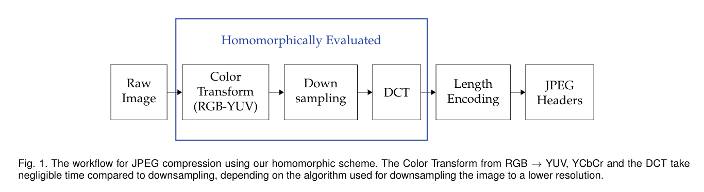

# Fast Homomorphic Video Transcoding 

## Idea behind FHE Video Transcoding
Video transcoding cuts the frames of the video into blocks, which is then compressed using frequency analysis. To compress video homomorphically, we implement the [discrete cosine transform](https://en.wikipedia.org/wiki/Discrete_cosine_transform) 
and multiply by a [quantization](https://en.wikipedia.org/wiki/Quantization_(image_processing)) factor to throw away the higher frequencies of our image. 

###  Simple Example: JPEG-2 Encoding

Since JPEG encoding is similar, we implemented FHE video transcoding for JPEG encoding first. 



## Installation Instructions

We use Microsoft's [SEAL](https://www.microsoft.com/en-us/research/publication/simple-encrypted-arithmetic-library-seal-v2-2/) library for most of the heavy lifting for the FHE side. Since it has no public repository, version 2.3 of the library has been added as a git submodule from an unofficial source.


We used ```g++-7``` as our default compiler for everything. If you want to change this change the ```CXX=``` portions of the makefile and the install script. The install script ```install.sh``` should update the git submodule containing SEAL and build it automatically. Then, you should be able to make our example programs in ```homo/```.


## Acknowledgements and External Sources

We used a few external libraries and source code, here are links to their respective pages!
* [SEAL](https://www.microsoft.com/en-us/research/publication/simple-encrypted-arithmetic-library-seal-v2-2/), a homomorphic computation library from Microsoft Research
* [Jon Olick](https://www.jonolick.com/code.html)'s JPEG encoder
* [Lecture Notes](http://www.intensecrypto.org/public/index.html) by Boaz Barak that got us started
* [ffmpeg](https://www.ffmpeg.org/), video transcoding and audio processing library
* [C++ Command Line Options](https://github.com/jarro2783/cxxopts), for quality of life